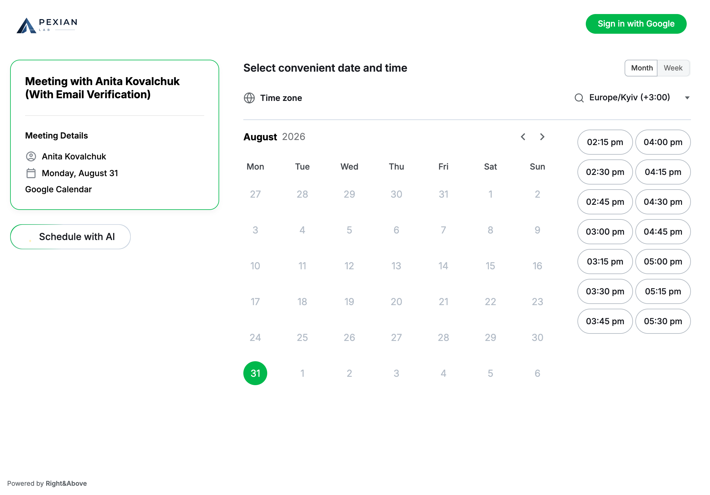
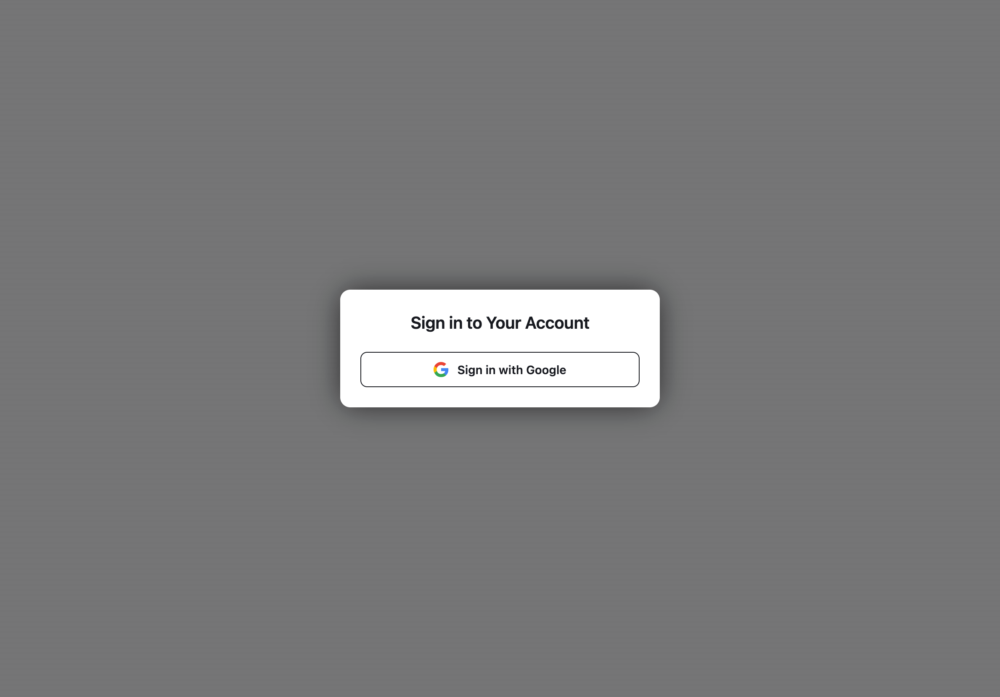

# Apexianlab — Meeting Scheduler

[](LICENSE)
[](https://www.php.net/)
[](https://wordpress.org/)
[](https://www.postgresql.org/)

Self-hosted meeting scheduling for WordPress — Google Calendar, guest booking on your domain, and an optional AI assistant. Built by [Right&Above, LLC](https://rightandabove.com/).

**[Live demo](https://apexianlab-calendar.rightandabove.com/)** · **[White paper](docs/WHITEPAPER.md)** · **[Security policy](SECURITY.md)**

---

## Screenshots

### Public booking

Guests pick a date and time against the organiser’s real Google Calendar availability.



### Organiser sign-in

Schedule owners connect with Google — the same OAuth grant powers Calendar access.



---

## Highlights

- **On your WordPress** — no Calendly-style SaaS for the booking UI
- **Google Calendar** — FreeBusy availability, events + Meet links
- **Google sign-in** — OAuth with PKCE for organisers
- **Email flows** — confirm, cancel, reschedule (SMTP or Gmail API)
- **Short links** — owner slug URLs for admin and public booking
- **AI assistant (optional)** — chat to find slots, book, reschedule, cancel
- **Any theme** — page templates and captcha ship inside the plugin

---

## Requirements

- PHP 8.2+ (`match` expressions, readonly properties)
- WordPress 6.0+
- PostgreSQL 13+ database (uses `gen_random_uuid()`)
- A Google Cloud OAuth 2.0 client (Calendar API enabled) — used for both
  sign-in and calendar access
- An SMTP server for outbound mail (optional but recommended)
- A real cron hitting `wp-cron.php` (see [Background jobs](#background-jobs-wp-cron--production-setup))

---

## Installation

1. Copy the plugin to:

```
wp-content/plugins/apexianlab-meeting-scheduler/
```

2. Activate the plugin. It creates the `cal`, `schedule`, and `ai-assistant`
   pages (with the correct templates) and flushes rewrite rules.

3. Add the required constants to `wp-config.php` (see [Configuration](#configuration)).

4. Under **Settings → Permalinks**, use a pretty permalink structure (e.g. Post
   name) if you are not already.

5. Disable WordPress' internal cron and run a real cron — see [Background jobs](#background-jobs-wp-cron--production-setup).

---

## Features

- **Meeting Scheduling** — recurring weekly schedules, custom-interval schedules, non-repeating date lists.
- **Google sign-in** — schedule owners sign in with their Google account; the same OAuth grant provides calendar access.
- **Google Calendar** — creates Calendar events (with Google Meet links) in the organiser's `primary` calendar and reads FreeBusy for availability.
- **Email Notifications** — confirmation + organiser emails. The `From` address is the schedule owner's mailbox; the display name comes from the schedule's `name_format`.
- **Email verification toggle** (per schedule) — `Require email verification`. Off (default): every booking is auto-confirmed immediately. On: the attendee must click a link emailed to them before the booking is finalised.
- **Google access guard** — if the schedule owner declined any required Google permission at consent time, schedule create/update is blocked (server-side) and a banner with a *Reconnect* button is shown, so a non-functional schedule cannot be shared.
- **Short links** — `/cal/<id>/` URLs with base62 IDs.
- **AI Assistant** (optional) — LLM-backed chat agent that can find slots, book, reschedule, and cancel.

---

## Usage

### Creating a Schedule

Created via the `create-schedule.php` template page (owner must sign in with
Google). Owners define working hours, time slots, communication type,
reminders, and connect their Google Calendar.

### Booking a Meeting

Booked via the `meeting-booking.php` template page. The system checks
availability against the owner's Google Calendar (FreeBusy), creates the
Calendar event, and sends confirmation emails.

---

## Configuration

All settings live in `wp-config.php`.

### Required — PostgreSQL

```php
define('CALENDAR_HOST',   'enabled');   // any non-empty value; gates the calendar module
define('CALENDAR_PRODID', 'Apexianlab');

define('POSTGRESQL_HOST',     'db.example.com');
define('POSTGRESQL_DBNAME',   'calendar');
define('POSTGRESQL_USER',     'calendar_user');
define('POSTGRESQL_PASSWORD', 'your-db-password');
```

### Required — Google OAuth (sign-in + calendar)

Create an OAuth 2.0 client in Google Cloud (Calendar API enabled). Register
the redirect URI `https://your-site.example/?google_calendar_callback=1`.

```php
define('GOOGLE_CALENDAR_CLIENT_ID',     '<client-id>.apps.googleusercontent.com');
define('GOOGLE_CALENDAR_CLIENT_SECRET', '…');
// Optional overrides:
define('GOOGLE_CALENDAR_SCOPES',        'openid email profile https://www.googleapis.com/auth/calendar https://www.googleapis.com/auth/calendar.events https://www.googleapis.com/auth/gmail.send');
define('GOOGLE_CALENDAR_REDIRECT_URI',  'https://your-site.example/?google_calendar_callback=1');
```

Sign-in flow: the login entry point (`?apexianlab_google_login=1`, or `requireAuth()`
on gated pages) redirects to Google; the callback stores the user identity in
the session and persists the OAuth token for background calendar work.

**Required permissions.** Google's consent screen lets the user untick individual
scopes. Every granular scope in `GOOGLE_CALENDAR_SCOPES` (calendar + `gmail.send`)
must be granted, otherwise bookings cannot create calendar events or send mail.
The plugin records the granted scope set (`calendar_google_credentials.granted_scopes`)
and **blocks schedule create/update** until the owner reconnects and grants
everything (a banner with a *Reconnect* button is shown in the modal). Declining
consent (`error=access_denied`, no `code`) is handled gracefully — the user is
bounced back to `/schedule/`, not an error page.

**Unverified app / Testing mode.** While the OAuth consent screen is in *Testing*
(unverified), only accounts added under **Test users** in Google Cloud Console
can sign in; others get `access_denied`.

### Admin access

Restrict the `/schedule/` admin area to one email domain:

```php
define('SCHEDULE_LOGIN_DOMAIN', 'example.com');
```

If `SCHEDULE_LOGIN_DOMAIN` is unset/empty, domain checks do not match any
mailbox (safe default for public installs). Demo deployments can open admin to
every signed-in Google account:

```php
define('SCHEDULE_ALLOW_ANY_ACCOUNT', true);
```

This only lifts the gate on `/schedule/` (`ScheduleAdminRouter`,
`requireAuthorizedAdmin()`). `isAdminEmailAllowed()` keeps its domain meaning, so
the privilege to cancel *any* meeting without email confirmation stays with
`SCHEDULE_LOGIN_DOMAIN` accounts and the schedule owner.

### Pages (created automatically)

On activation (and once on upgrade) the plugin creates / publishes:

| Slug | Template | Role |
| --- | --- | --- |
| `cal` | Meeting Booking | Public booking shell (also used by slug URLs) |
| `schedule` | Create Schedule | Owner admin shell |
| `ai-assistant` | AI Assistant | Optional AI UI |

You do **not** need to pick a special theme: captcha and page templates ship
inside the plugin. After activation, set **Settings → Permalinks** to a pretty
structure (Post name) once if pretty URLs are not already enabled — the plugin
also flushes rewrite rules on activation.

### Outbound mail (SMTP)

`wp_mail()` is routed through SMTP when `SMTP_HOST` is defined:

```php
define('SMTP_HOST',   'smtp.example.com');
define('SMTP_PORT',   587);
define('SMTP_EMAIL',  'no-reply@example.com'); // SMTP auth user (optional)
define('SMTP_PASS',   '…');                    // optional
define('SMTP_SECURE', 'tls');                  // optional
```

The per-email `From` header is set to the schedule owner's address + name_format
display name (see `NotificationService::buildFromHeader`).

### Background work — required in production

```php
define('DISABLE_WP_CRON', true);
```

See [Background jobs](#background-jobs-wp-cron--production-setup).

### AI assistant (optional)

```php
define('APEXIANLAB_LLM_BASE_URL', 'https://llm.example.com/v1');
define('APEXIANLAB_LLM_MODEL',    'llama3.1');
define('APEXIANLAB_LLM_API_KEY',  '…');                          // optional
define('APEXIANLAB_STT_BASE_URL', 'https://stt.example.com/v1'); // optional, falls back to APEXIANLAB_LLM_BASE_URL
define('APEXIANLAB_STT_MODEL',    'whisper-1');                  // optional
```

---

## Database Schema

Key tables created by the migrator:

- `calendar_schedule` — meeting schedules (incl. `is_public`, `require_email_verification`)
- `calendar_booking` — meeting bookings
- `calendar_means_of_communication` — communication types
- `calendar_google_credentials` — Google OAuth tokens (per schedule owner; incl. `granted_scopes`)
- `ai_chats` / `ai_chat_*` — AI assistant state (optional)

---

## Security

- All inputs sanitized and validated; all outputs escaped.
- Nonces on AJAX requests; OAuth `state` + PKCE on the Google sign-in flow.
- Google tokens stored encrypted (AES-256-GCM).

---

## Architecture

- `includes/Plugin.php` — bootstrap, hook registration, asset enqueue
- `includes/Autoloader.php` — autoloader for the `Apexianlab\Calendar\` namespace
- `includes/Config.php` — configuration (constants)
- `includes/MeetingBookingTemplate.php` — booking page template handler
- `includes/Database/Connection.php` — PostgreSQL PDO connection
- `includes/Migration/Migrator.php` — schema migrations runner
- `includes/Ajax/` — AJAX handlers (booking, availability, schedule)
- `includes/Auth/GoogleOAuthHandler.php` — Google sign-in + calendar OAuth
- `includes/Repository/` — PDO repositories (booking, schedule, means, credentials)
- `includes/Service/` — domain services (booking, availability, integration, notification, Google Calendar)
- `includes/Helper/` — display/time/color helpers
- `includes/Dto/` — data transfer objects
- `includes/AiAssistant/` — AI assistant chat agent
- `templates/` — page + email templates
- `assets/` — CSS, JavaScript, images

---

## Error Handling

Graceful degradation: missing dependencies show admin notices but don't break
the site; Google API failures don't break the booking flow; all errors are
logged.

---

## Background jobs (WP-Cron) — production setup

Long-running work is deferred to WP-Cron so the user-facing response stays fast:

| Hook | Triggered by | Work |
| --- | --- | --- |
| `apexianlab_send_confirmed_emails` | After a booking is confirmed | Sends attendee + organiser confirmation emails |
| `apexianlab_cleanup_cancelled_meeting` | After cancel | Deletes the Google Calendar event + sends cancellation emails |
| `apexianlab_sync_schedule_google` | After schedule create/update | Mirrors availability windows into the owner's Google calendar |
| `apexianlab_delete_schedule_google` | After schedule delete | Removes the mirrored availability events |

In WordPress' default "internal" mode WP-Cron only runs when a visitor hits the
site. Configure a real cron in production.

### 1. Disable WordPress' internal cron

```php
define('DISABLE_WP_CRON', true);
```

### 2. Run a real cron that hits `wp-cron.php`

Pick **one** option.

#### Option A — System cron (recommended)

```cron
* * * * * curl -s -o /dev/null -m 60 https://your-site.example/wp-cron.php
```

#### Option B — Hosted cron services

Any provider that hits a URL on a schedule (cron-job.org, EasyCron, Cloudflare
Cron Triggers, GitHub Actions, etc.).

Notes:

- **Do not pass `?doing_wp_cron=…`** in the URL — `wp-cron.php` would compare it
  to the `doing_cron` transient and exit on mismatch.
- The default lock TTL is 60 s (`WP_CRON_LOCK_TIMEOUT`).

### 3. Verifying

With [WP-CLI](https://wp-cli.org/) on the server:

```bash
wp cron event list
wp transient delete doing_cron
```

Or from PHP in a one-off shell (path to WordPress may differ):

```bash
php -r "require 'wp-load.php'; print_r(_get_cron_array());"
php -r "require 'wp-load.php'; delete_transient('doing_cron');"
```

---

## Documentation

- [White paper](docs/WHITEPAPER.md) — one-page product overview
- [Security policy](SECURITY.md) — how to report vulnerabilities

---

## License

[GPLv2 or later](LICENSE)